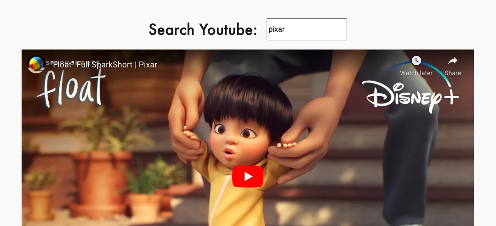
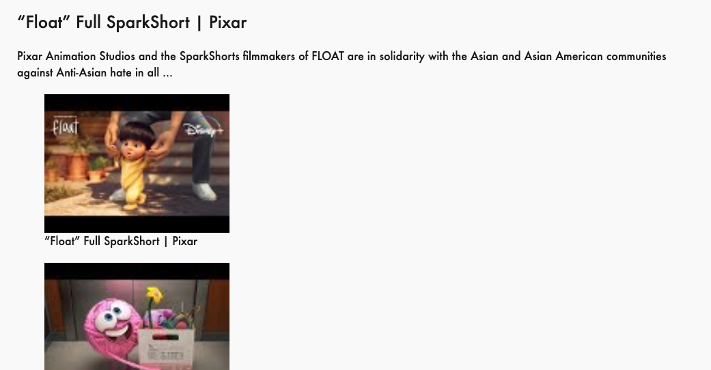

<<<<<<< HEAD
# SA3 - React Intro

Building off our starter pack to build our first react app!!

Note: the couple late commits were just to fix the .gitignore, which was not working. This lab was turned in on time. Thanks!!

[deployed url](https://angry-shannon-67e8cc.netlify.app/)

## What Worked Well

This was a lot of copy-and-paste, which wasn't too difficult to finish

## What Didn't

While it was easy to follow instructions, it was harder to understand them. React is a confusing thing in the beginning, but I assume I'll gain a much better understanding from the labs

## Extra Credit

Nothing too fancy with APIs, but some nice styling

## Screenshots

=======
# William Toth - SA2 - Starter Pack

Short Assignment to build a server / web app from scratch!!

[deployed url](https://confident-davinci-91dfdf.netlify.app/)

## What Worked Well

The instructions were relatively copy-and-paste, so there was clarity on what to do.

## What Didn't

While the instructions were easy to follow, they were difficult to understand. There were a lot of moving parts, and I'm still not sure I really get how a server works, although my understanding is much better now.

## Extra Credit

## Screenshots

>>>>>>> cc05cea58bcf1298de18662966f716d8d455e513
